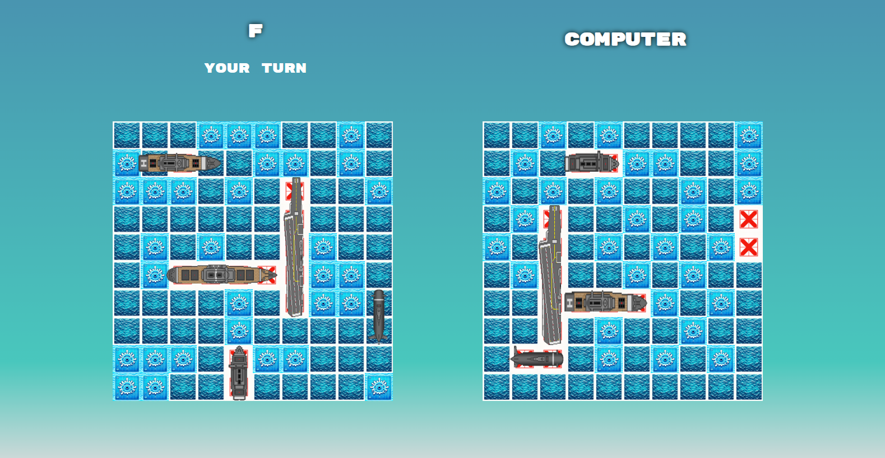

# Battleships Game - The Odin Project

**Test driven development practice implementing a battleships game using JavaScript, Jest, HTML, and CSS. Bundled with Webpack.**

🔗 [Live Link](https://antonharbers.github.io/Battleships/)



## 🚀 Getting Started

To get started with this project:

1. Clone the repo:
   ```
   git clone <your-repo-url>
   ```
2. Install dependencies:
   ```
   npm install
   ```
3. Run the development server:
   ```
   npm run watch
   ```
   This command bundles the code with Webpack and updates in real time as you tweak the code.
4. Open `index.html` in the `dist` directory on a live server to see the game in action.

_Note: Ensure Node.js and all dependencies are installed on your local machine._

## 🎯 Key Concepts

### Test-Driven Development (TDD)

In this project, I adopted the Test-Driven Development (TDD) methodology, which involves writing tests before developing the actual functionality. This ensures that each function is designed to meet its requirements from the outset.

In my implementation, TDD is evident in the structured design of classes like `Ship` and `Gameboard`. For instance, the `isSunk` method in the `Ship` class was developed to pass predetermined tests, ensuring reliable functionality.

TDD is an essential practice in professional software development. It maintains high code quality and reduces the occurrence of bugs, leading to more robust and maintainable software solutions.

### Separation of Logic through Classes

My project demonstrates the principle of separating logic through classes, where different sections of the program are responsible for specific tasks. This approach enhances code readability and maintainability.

```javascript
class Ship {
  // Logic specific to ships
}

class Gameboard {
  // Logic specific to the gameboard management
}

class Player {
  // Logic specific to player actions
}
```

Each class in my Battleships game has distinct responsibilities: `Gameboard` manages the state of the game, and `Player` handles actions like attacking enemy coordinates.

In real-world software engineering, this concept is vital for building scalable and well-organized codebases, making them easier to update, debug, and collaborate on.

### AI Player Development

In the project, I developed an AI player represented as a `Player` instance. The AI makes strategic decisions about where to attack, simulating a human opponent and adding complexity to the game.

AI in gaming, as demonstrated in my project, provides dynamic and engaging gameplay. Beyond gaming, AI algorithms are pivotal in various sectors, including healthcare, finance, and autonomous vehicles, driving significant advancements.

## 📚 Documentation

### Main Game Loop

The core of my Battleships game is the main game loop. It controls the flow of the game, responding to user inputs and updating the game state accordingly.

```javascript
const NextTurn = () => {
  // Logic to manage turn transitions and game state checks
};

const makeComputerMove = () => {
  // Logic for AI's decision-making
};

// Event listeners for initiating the game and setting up initial conditions
startGameButton.addEventListener('click', StartGame);
// ...
```

The `NextTurn` and `makeComputerMove` functions are crucial, managing the turn-based mechanics of the game. The event listeners facilitate initial game setup and player interactions.

### Ship Class

```javascript
class Ship {
  constructor(name, length) {
    this.name = name;
    this.length = length;
    this.hits = 0;
    this.sunk = false;
  }

  hit() {
    this.hits++;
    this.isSunk();
  }

  isSunk() {
    if (this.hits == this.length) {
      this.sunk = true;
    }
  }
}
```

The `Ship` class represents individual ships with properties like `name`, `length`, and `sunk` status.

### Gameboard Class

```javascript
class Gameboard {
  // ...
  placeShip(name, length, x, y, isHorizontal) {
    // ...
  }

  receiveAttack(x, y) {
    // ...
  }
  // ...
}
```

`Gameboard` manages the state of the game board, including ship placement and handling attacks.

### Player Class

```javascript
class Player {
  // ...
  attackCoordinates(x, y) {
    // ...
  }
  // ...
}
```

The `Player` class, which includes both human and AI players, handles actions like attacking enemy coordinates.

### Helpers and Rendering

The `helpers.js` and `rendering.js` files contain utility functions for ship placement, board rendering, and event handling.

## 📝 Final Notes

Undertaking this Battleships game project has been a formidable challenge, but one that has significantly contributed to my growth as a developer. The complexity of the project, encompassing aspects like Test-Driven Development, AI player logic, and the separation of concerns through classes, provided a comprehensive learning experience. It pushed the boundaries of my problem-solving skills and deepened my understanding of JavaScript, Jest, HTML, and CSS.

This game is not only a milestone in my coding journey but also a project I look forward to revisiting in the future. The principles applied and lessons learned here are not static; they will evolve as I continue to grow in my coding career. Revisiting this project will offer a unique opportunity to see my progression as a developer and to enhance the game with new skills and insights.

For other aspiring developers, this project serves as a testament to the importance of challenging oneself and stepping outside the comfort zone. It's a practical example of how complex concepts can be implemented in a real-world application. The key concepts utilized in this project—TDD, AI development, and logic separation—are not just academic exercises; they are pivotal in building robust, scalable, and efficient software in the professional world.

By studying this project, others can gain insights into how these methodologies and concepts can be practically applied, offering a valuable learning experience. It demonstrates how foundational principles in software development are not just theory but vital tools that shape the way we solve problems and build solutions.

Whether for educational purposes or as a starting point for their own projects, I hope that this Battleships game will serve as an inspiring example for others in the programming community. It's a reminder of how much we can learn from taking on challenges and how these experiences prepare us for real-world software development.

## ✅ To-Dos

- [ ] Add PvP (Player vs Player) feature.
